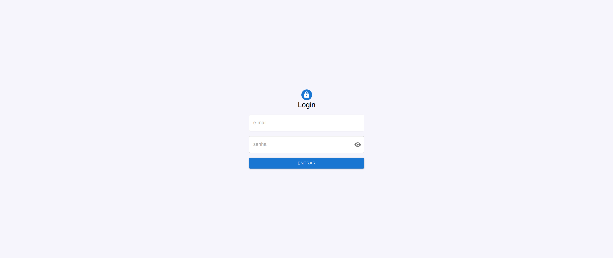
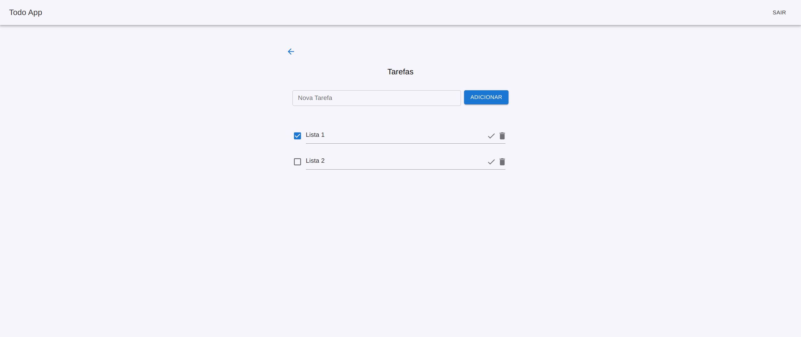

# Todo List App

## Descrição do Projeto

Esta aplicação é uma ferramenta para gerenciar listas de tarefas. O usuário pode se autenticar na página de login e, uma vez autenticado, pode criar, editar e gerenciar listas de tarefas. Cada lista pode ter várias tarefas associadas e permite ao usuário:

- Adicionar uma cor para cada lista.
- Criar, renomear e apagar listas.
- Adicionar, editar, apagar e marcar tarefas como concluídas.

## Tecnologias Utilizadas

- **[React](https://reactjs.org/)**
- **[Vite](https://vitejs.dev/)**
- **[TypeScript](https://www.typescriptlang.org/)**
- **[Material-UI](https://mui.com/)**

## Funcionalidades

- **Autenticação**: O usuário precisa se autenticar para acessar a aplicação.
- **Gerenciamento de Listas**: Criação, renomeação, alteração de cor e exclusão de listas de tarefas.
- **Gerenciamento de Tarefas**: Criação, edição, exclusão e marcação de tarefas como concluídas.

## Capturas de Tela

### Página de Login



### Lista de Tarefas


### Detalhes da Tarefa



## Credenciais de Acesso

Para facilitar o acesso inicial à aplicação, você pode utilizar as seguintes credenciais padrão:

- **E-mail**: `user@example.com`
- **Senha**: `password123`

Essas credenciais já estão definidas no banco de dados e podem ser usadas para explorar as funcionalidades da aplicação.

## Estrutura do Projeto

```plaintext
/
├── src/
│   ├── components/      # Componentes reutilizáveis
│   ├── contexts/        # Contextos para estado global
│   ├── errors/          # Tratamento de erros
│   ├── hooks/           # Hooks customizados
│   ├── pages/           # Páginas principais da aplicação
│   ├── routes/          # Configuração de rotas da aplicação
│   ├── App.tsx          # Componente principal da aplicação
│   ├── main.tsx         # Ponto de entrada do React
│   └── index.css        # Arquivo de estilos globais
├── public/              # Arquivos públicos
├── package.json         # Dependências e scripts
└── README.md            # Documentação do projeto
```
